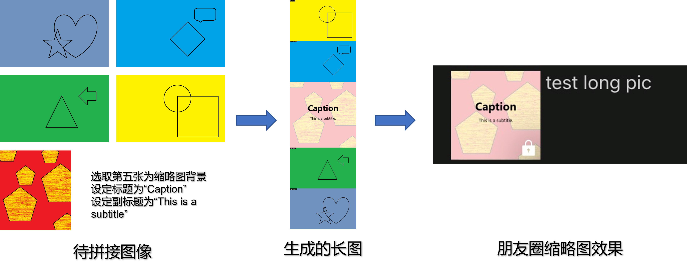

# 微信朋友圈指定缩略图长图生成器
## 介绍
使用该脚本可生成发布微信朋友圈九宫格时，显示指定缩略图的长图。利用的是微信朋友圈图像长图的缩略图裁剪正中的特性。

## 使用方法
Clone本项目至本地，在脚本所在目录中启动终端，运行
```
python main.py <directory/of/config.yml>
```
其中第一个参数`<directory/of/config.yml>` 为配置文件的地址。以附带的示范配置文件为例：
```
python main.py sample_config.yml
```
脚本将根据配置文件中的要求，生成所需的长图。
## 配置文件编写
由于目前还未编写GUI，对每个长图的要求（如指定待拼接图像、设置标题、设置字体等）需通过编写配置文件的方式来实现。可直接复制位于本目录下的`sample_config.yml`并按其中要求，根据自己需要进行更改。

## 关于
该脚本是因为本人旅游后未能及时整理照片发朋友圈，方便之后再攒一起发拼图编写。目前版本仅仅能够运行，仍有较多功能未实现或具有较多bug，欢迎使用并反馈！