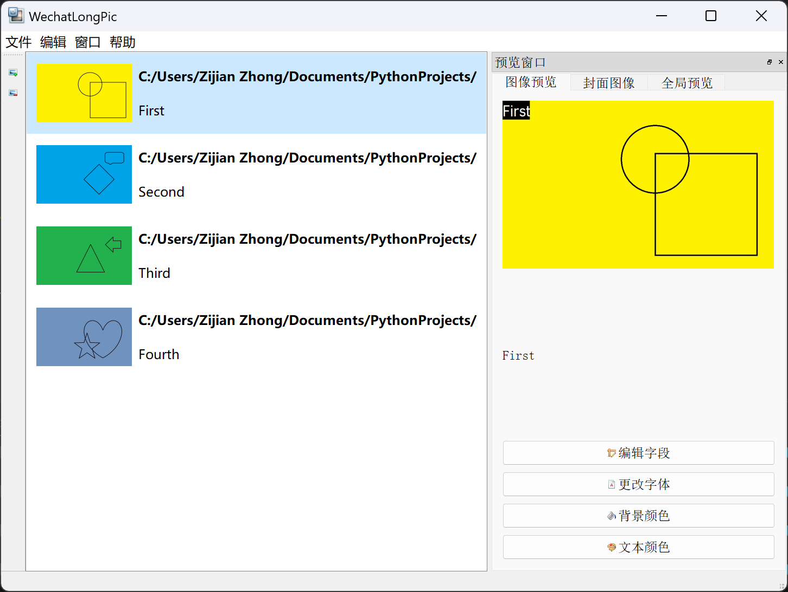

# 微信朋友圈指定缩略图长图生成器
## 介绍
使用该脚本可生成发布微信朋友圈九宫格时，显示指定缩略图的长图。利用的是微信朋友圈图像长图的缩略图裁剪正中的特性。

## 更新内容
1. 基于PyQt5对Picture类中的图片编辑功能进行重写；
2. 基于PyQt5实现GUI化，功能与前一命令行版本一致，操作预览更加直观；
3. 提供针对单一图像修改字体格式功能；
4. 提供不指定缩略图像仅进行拼图功能；
5. 提供批量修改图像文本及格式功能;
6. 提供九宫格切图功能。
## 使用方法
### 使用Release版本
从项目Release中下载后解压即可运行。使用左侧工具栏添加或删除待拼接图像。使用右侧预览窗口对图像上的说明文本进行修改、指定朋友圈缩略图、生成拼图并保存至本地文件。

### 从源代码执行
本项目基于PyQt5开发，请先将其安装在Python环境中
```
pip install PyQt5
```
Clone本项目至本地，在脚本所在目录中启动终端，运行
```
python main.py
```
## 短期更新计划
1. 兼容旧版本配置文件，提供从配置文件导入功能；
2. 提供项目写入/读取功能，将当前工作状态保存至本地；
3. 优化预览窗格预览及编辑体验。

## 长期更新计划
1. 对单一图像提供在任意位置插入文本功能；
2. 对单一图像提供简易的编辑功能；
3. 对拼接图像提供使用图片填充空白部分功能。

## 关于
该脚本是因为本人旅游后未能及时整理照片发朋友圈，方便之后再攒一起发拼图编写。如有帮助，欢迎使用并反馈！